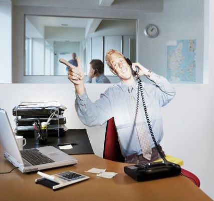
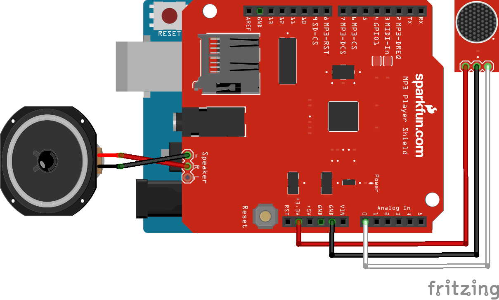

Remote Employee
===

If you are a Remote Employee, like me, you likely are missed by your fellow employees.  Why not give them the next best thing? A super over the top Cutout of you they can stick in their office to talk to whenever they feel like it !!!

__Your Cutout will help / annoy your fellow coworkers by:__

* Listening to what they have to say
* Having a Random Response

Table of Contents
---

* [Part List](#part-list)
* [Hardware Assembly](#hardware-assembly)
* [Wiring Instructions](#wiring-instructions)
* [Recording Voices](#recording-voices)
* [Software Installation](#software-installation)
* [Making a Cutout](#making-a-cutout)
* [Using your Remote Employee](#using-your-remote-employee)

Part List
---

**[⇧ back to top](#table-of-contents)**

#### You will need to purchase the following hardware:

* `ARD` [Arduino Uno R3](https://www.adafruit.com/products/50?utm_medium=referral&utm_source=manifestinteractive) _$24.95_
* `MP3` [Adafruit "Music Maker" MP3 Shield ( with amp )](https://www.adafruit.com/products/1788?utm_medium=referral&utm_source=manifestinteractive) _$34.95_
* `MIC` [Electret Microphone Amplifier - MAX4466](https://www.adafruit.com/products/1063?utm_medium=referral&utm_source=manifestinteractive) _$6.95_
* `SPK` [Speaker - 3" Diameter - 4 Ohm 3 Watt](https://www.adafruit.com/products/1314?utm_medium=referral&utm_source=manifestinteractive) _$1.95_

#### Other stuff you'll likely need:

* [Micro SD Card ( 2GB )](http://www.amazon.com/Sandisk-2GB-Micro-Sd-Card/dp/B000N3LL02) _$7.95_
* [Arduino Project Enclosure](https://www.amazon.com/Arduino-06RBARD16-Box/dp/B003ZKJNVY) _$13.63_

Hardware Assembly
---

There are really good writeups by Adafruit on how to assemble the hardware:

* [Attach MP3 Shield](https://learn.adafruit.com/adafruit-music-maker-shield-vs1053-mp3-wav-wave-ogg-vorbis-player?view=all)
* [Attach Microphone](https://learn.adafruit.com/3d-printed-led-microphone-flag?view=all)

Wiring Instructions
---

**[⇧ back to top](#table-of-contents)**

Since the `MP3` shield will be placed directly on top of the `ARD` Arduino, you will need to hook everything up using the following method:

| Part | Pin    | > | Part | Pin  | Cable  |
|------|--------|---|------|------|--------|
| MIC  | VCC    | > | MP3  | 3.3V | Red    |
| MIC  | GND    | > | MP3  | GND  | Black  |
| MIC  | AUD    | > | MP3  | A0   | White  |
| SPK  | -      | > | MP3  | -    | Red    |
| SPK  | +      | > | MP3  | +    | Black  |

Recording Voices
---

The `MP3` device can hold up to 2GB of audio files so you can record as many as you want to fill up this 2GB card ( which is the largest size this MP3 shield supports ).  The MP3 shield also has a weird caveat where the file names must be 8 characters in length. For that reason I was naming the files `voice_010.mp3`.  I also chose to start the file naming `010` because of how Arduino Random numbers work.  So you should likely avoid the headache and use this same convention.

As far as the how to actually record the audio files, you can use your Smart Phone to just record a few phrases you think would be fun to have.  Just keep in mind that you want to not have a whole lot of noise in the background, and you will likely want to make sure you are only recording what you want in the MP3 file.

There is a Free online audio converter at [http://media.io](http://media.io) if you need to convert your audio files.

Software Installation
---

**[⇧ back to top](#table-of-contents)**

Before you install the software onto your Arduino Uno, you will want to copy all the audio files in the [./sounds](sounds) folder into the root of your Micro SD Card, then insert the SD Card into the MP3 Shield.  Make sure not to put the files in any folders on the SD card.  They should be directly in the root of the card.

Once you have all the hardware installed, you just need to open the [./sketch/sketch.ino](sketch/sketch.ino) file in your [Arduino Code Editor](https://www.arduino.cc/en/Main/Software).  Now you just need to upload the sketch to your Arduino Uno.

Making a Cutout
---

This part is up to you, but you should have fun with it !!!

* You will need a camera that can take super high resolution pictures
* Take a LOT of different pictures and find the one you like best
* Use a Photo Editing program like PhotoShop and crop out the background so that only you are left
* Ask a Sign Making Company in your area to print your image using Corrugated PVC, or some other sturdy material ( if you use Cardboard it will get destroyed pretty quickly ) and ask them to make the cutout to the size you need ( if you are doing Life Size, give them your height )
* Once the cutout is complete, attach the hardware to the back of the cutout and add some power !!!

Using your Remote Employee
---

**[⇧ back to top](#table-of-contents)**

The voices are set to randomly play once the microphone detects talking has stopped.  Here is a break down of the basic logic for voice detection:

1. There is a running sample average of the microphone
2. Volume average peeks above average room noise
3. Above average volume continues for a second or more ( to prevent false triggering on quick loud sounds )
4. Wait for volume average to go back below speaking threshold
5. Please random audio clip

There is also logic in place to not pay attention to the audio sampling while an audio clip is playing ( otherwise it would also trigger that someone is talking ).